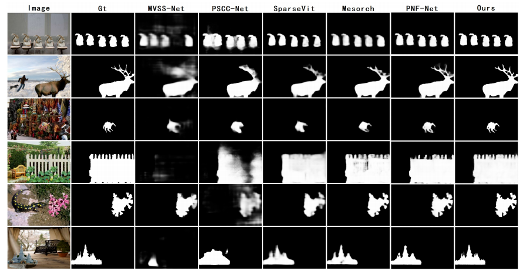

<div align="center">
<h1> HLD-Net: Mitigating Boundary Imbalance: A Body-Detail Decoupling Network for Image Manipulation Localization </h1>
</div>

<!-- ## 📢 News
* **[2025-11]** Our paper is accepted by **AAAI 2026**! 🎉🎉🎉
* **[2025-11]** The code are being organized and will be released shortly. Please star this repo for updates! -->

## ✨ Highlights
* 🚀 A novel label decoupling strategy based on Euclidean distance transform is proposed to split the tampering mask into body and detail branches, effectively alleviating the severe boundary pixel imbalance in image manipulation localization.

* 🧠 We design a dual-span hourglass Vision Transformer encoder and bidirectional decoupling pyramid decoder, which separately learns structural body features and fine-grained boundary details without mutual interference.


* ⚡ A body-detail adaptive relation module combining attention and graph convolution is introduced to adaptively fuse dual-branch features, ensuring region integrity and precise boundary localization.

* 🎯 Extensive experiments on eight mainstream benchmarks show that our method outperforms state-of-the-art models in F1-score, while maintaining lightweight parameters and strong robustness against various image distortions.

## 📻 Overview

## Network Overview


## 🎮 Quick start

### 1. Install Environment

To set up the experimental environment, please follow the specific requirements for each baseline model.

- Python >= 3.8
- PyTorch >= 1.10
- Torchvision
- OpenCV, NumPy, Scikit-image, Pillow, Tensorboard

### 2. Prepare Datasets
| Dataset     | Nums        |  #CM          | #SP          | #IP          |  #Train          |  #Test          | 
| :----:      |    :----:   |         :----:|:----:        |    :----:    |         :----:   |         :----:  |
| CASIAv2   | 5123        | 3295          |1828          |    0         |        5123      |        0        |
| CASIAv1   | 920         | 459           |461           |    0         |        0         |        920      |
| Coverage    | 100         | 100           |0             |    0         |        70        |        30       |
| Columbia    | 180         | 0             |180           |    0         |         130      |        50       |
| NIST16      | 564         | 68            |288           |    208       |        414       |        150      |
|CocoGlide| 512 | - |  - | - | 0  |  512  |
|In-the-Wild      |201  | 0 | 201|-  | 0  |  201  |
|Korus   | 220 | -|-|-|0|220|
|DSO|100|-|-|-|0|100|
|IMD2020|2010|-|-|-|0|2010|


- CASIAv2 [Download](https://github.com/SunnyHaze/IML-Dataset-Corrections)
- CASIAv1 [Download](https://github.com/SunnyHaze/IML-Dataset-Corrections)
- Columbia  [Download](https://www.ee.columbia.edu/ln/dvmm/downloads/authsplcuncmp/)
- Coverage  [Download](https://github.com/wenbihan/coverage?tab=readme-ov-file)
- NIST16    [Download](https://mfc.nist.gov/users/sign_in)
- CocoGlide [Download](https://www.grip.unina.it/download/prog/TruFor/CocoGlide.zip)
- In-the-Wild [Download](https://minyoungg.github.io/selfconsistency/)
- Korus [Download](https://pkorus.pl/downloads/dataset-realistic-tampering)
- DSO [Download](http://ic.unicamp.br/~rocha/pub/downloads/2014-tiago-carvalho-thesis/tifs-database.zip)
- IMD2020 [Download](https://staff.utia.cas.cz/novozada/db/)


### 3. Train

To train our model, first ensure that the pretrained [PvtV2](https://github.com/wkcn/tinyvit/) weights are ready, and then simply run the corresponding training script.
```bash
# Make sure your directory paths are set correctly!
python train.py
```
### 4. Test
```bash
python test.py
```

## ✨ Visualization results 



## Citation
If you find our code useful, please consider citing us and give us a star!

