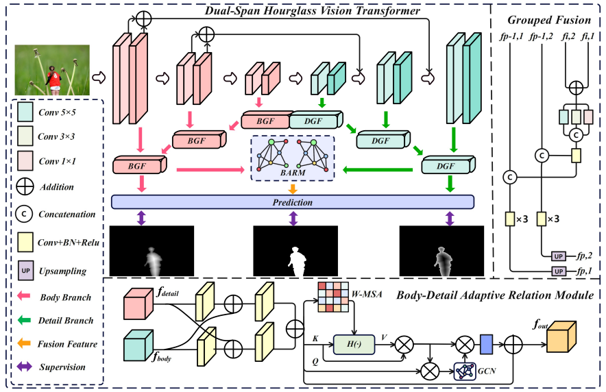

# HLD-Net: Mitigating Boundary Imbalance: A Body-Detail Decoupling Network for Image Manipulation Localization

## Introduction
Image Manipulation Localization (IML) plays an important role in multimedia forensics and information security. Existing methods suffer from severe boundary imbalance problem: pixels near the manipulation boundary bring large prediction errors. Traditional binary label supervision cannot distinguish internal regions and ambiguous boundary regions, which limits localization accuracy.

To solve this problem, we propose a novel **Hourglass Label Decoupling Network (HLD-Net)**. We decompose the original task into body region learning and detail boundary learning based on Euclidean Distance Transform (EDT). The proposed DH-ViT encoder, bidirectional decoupling pyramid decoder and body-detail adaptive relation module effectively learn structural features and fine boundary features separately.

Extensive experiments on eight mainstream IML benchmarks demonstrate that our HLD-Net achieves state-of-the-art performance on F1-score, generalization and robustness.

## Network Overview

## Datasets
We conduct experiments on 8 public image manipulation localization datasets, covering Copy-Move (CM), Splicing (SP) and Inpainting (IP). We use CASIAv2, NIST16 and Coverage as training set, and the rest as test set. All pure pristine images are removed following standard IML settings.

| Dataset | Total Images | CM | SP | IP | Train | Test |
|--------|-------------|----|----|----|-------|------|
| CASIAv2 | 5123 | 3295 | 1828 | 0 | 5123 | 0 |
| Coverage | 100 | 100 | 0 | 0 | 70 | 30 |
| NIST16 | 564 | 68 | 288 | 208 | 383 | 181 |
| CASIAv1 | 920 | 459 | 461 | 0 | 0 | 920 |
| Columbia | 512 | 180 | 0 | 180 | 0 | 512 |
| CocoGlide | 180 | 0 | 180 | 0 | 0 | 180 |
| ITW | 201 | 0 | 201 | 0 | 0 | 201 |
| Korus | 220 | 0 | 0 | 220 | 0 | 220 |

## Environment & Installation
### Requirements
- Python >= 3.8
- PyTorch >= 1.10
- Torchvision
- OpenCV, NumPy, Scikit-image, Pillow, Tensorboard
